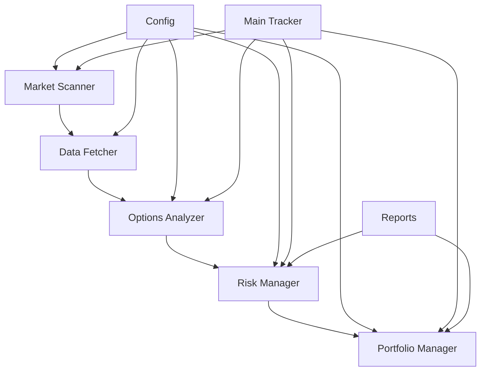

# 🚀 Market Cap Options Tracker

> **Advanced Options Trading System for All Market Cap Ranges**

A sophisticated Python-based trading system that automatically scans, analyzes, and recommends call options opportunities across all market cap ranges. Built with real-time data integration, comprehensive risk management, and intelligent portfolio optimization.


## 📊 Project Overview

The Market Cap Options Tracker is designed to identify high-probability call options opportunities across all market cap ranges (from micro-cap to mega-cap) using advanced technical analysis, fundamental screening, and options-specific metrics.

### Key Features

- 🔍 **Flexible Market Cap Scanning**: Configurable range from $100M to $1T+ market cap
- 📈 **Technical Analysis**: RSI, moving averages, volume analysis, and pattern recognition
- 🎯 **Options Analysis**: Greeks calculation, liquidity scoring, and risk/reward assessment
- 🛡️ **Risk Management**: Position sizing, portfolio correlation analysis, and stop-loss management
- 📊 **Performance Tracking**: Real-time P&L monitoring and performance analytics
- 🤖 **Automated Monitoring**: Continuous position monitoring with exit signals

## 🏗️ Architecture



> 📖 **Detailed Architecture**: See [docs/architecture.md](docs/architecture.md) for comprehensive system design

## 📁 Project Structure

```
Market-Cap-Options-Tracker/
├── 📄 main.py                 # Main application entry point
├── 📄 config.py               # Configuration management
├── 📄 config.json             # Trading parameters
├── 📄 requirements.txt        # Python dependencies
├── 📁 utils/                  # Core modules
│   ├── 📄 data_fetcher.py    # Real-time data collection
│   ├── 📄 market_scanner.py  # Stock screening & filtering
│   ├── 📄 options_analyzer.py # Options analysis & scoring
│   ├── 📄 portfolio_manager.py # Position & performance tracking
│   ├── 📄 risk_manager.py    # Risk management & analytics
│   └── 📄 test_utils.py      # Testing utilities
├── 📁 data/                   # Data storage
│   └── 📁 cache/             # Cached market data
├── 📁 reports/                # Performance reports
├── 📁 logs/                   # Application logs
├── 📁 docs/                   # Documentation
│   ├── 📄 architecture.md    # System architecture
│   ├── 📄 quick_start.md    # Quick start guide
│   └── 📄 system_flow.md    # Visual process flow
└── 📄 README.md              # This file
```

## 🚀 Quick Start

> ⚡ **Quick Start Guide**: For step-by-step instructions, see [docs/quick_start.md](docs/quick_start.md)

### 1. Installation

```bash
# Clone the repository
git clone https://github.com/yourusername/Market-Cap-Options-Tracker.git
cd Market-Cap-Options-Tracker

# Create virtual environment
python -m venv .venv
source .venv/bin/activate  # On Windows: .venv\Scripts\activate

# Install dependencies
pip install -r requirements.txt
```

### 2. Configuration

Edit `config.json` to customize your trading parameters:

```json
{
  "trading": {
    "market_cap_min": 100000000,     // $100M minimum (micro-cap)
    "market_cap_max": 1000000000000, // $1T maximum (mega-cap)
    "min_volume": 2000000,           // Minimum daily volume
    "max_position_size": 0.05,       // 5% max position size
    "stop_loss_percent": 0.30,       // 30% stop loss
    "take_profit_percent": 0.50      // 50% profit target
  },
  "scanner": {
    "min_revenue_growth": 0.15,      // 15% revenue growth
    "min_earnings_growth": 0.10,     // 10% earnings growth
    "max_pe_ratio": 100             // Maximum PE ratio
  }
}
```

### Market Cap Range Examples

| Strategy | Min Market Cap | Max Market Cap | Description |
|----------|----------------|----------------|-------------|
| **Micro-Cap** | $100M | $500M | High growth, high risk |
| **Small-Cap** | $500M | $2B | Growth potential, moderate risk |
| **Mid-Cap** | $2B | $10B | Balanced growth and stability |
| **Large-Cap** | $10B | $100B | Established companies |
| **Mega-Cap** | $100B | $1T+ | Blue-chip stocks |

### 3. Run the Tracker

```bash
# Scan for new opportunities
python main.py --scan

# Monitor existing positions
python main.py --monitor

# Run both scan and monitor
python main.py

# Clear cached data
python main.py --clear-cache
```

## 📊 Usage Examples

### Basic Scanning

```python
from main import OptionsTracker

# Initialize tracker
tracker = OptionsTracker('config.json')

# Find opportunities
opportunities = tracker.find_opportunities(top_n=10)

# Monitor positions
exit_signals = tracker.monitor_positions()
```

### Custom Configuration for Different Market Caps

```python
from config import Config

# Micro-Cap Strategy
config.trading.market_cap_min = 100_000_000   # $100M
config.trading.market_cap_max = 500_000_000   # $500M

# Large-Cap Strategy  
config.trading.market_cap_min = 10_000_000_000  # $10B
config.trading.market_cap_max = 100_000_000_000 # $100B
```

## 🔍 How It Works

### 1. Market Scanning Process

```mermaid
flowchart LR
    A[Fetch Stock Universe] --> B[Apply Market Cap Filter]
    B --> C[Volume Screening]
    C --> D[Fundamental Analysis]
    D --> E[Technical Analysis]
    E --> F[Pattern Recognition]
    F --> G[Options Chain Analysis]
    G --> H[Risk Scoring]
    H --> I[Top Recommendations]
```



### 2. Market Cap Adaptive Analysis

The system automatically adjusts its analysis based on the market cap range:

| Market Cap Range | Volume Requirements | Growth Expectations | Risk Profile | Options Focus |
|------------------|-------------------|-------------------|--------------|---------------|
| **Micro-Cap** ($100M-$500M) | 500K+ | 25%+ revenue growth | High risk/high reward | Limited options, focus on liquidity |
| **Small-Cap** ($500M-$2B) | 1M+ | 15%+ revenue growth | Moderate risk | Balanced options analysis |
| **Mid-Cap** ($2B-$10B) | 2M+ | 10%+ revenue growth | Moderate risk | Full options analysis |
| **Large-Cap** ($10B-$100B) | 5M+ | 5%+ revenue growth | Lower risk | Premium options focus |
| **Mega-Cap** ($100B+) | 10M+ | 3%+ revenue growth | Low risk | Institutional options |

### 3. Options Analysis

The system analyzes each option using multiple criteria:

| Metric | Weight | Description |
|--------|--------|-------------|
| **Moneyness** | 25% | Strike price vs current stock price |
| **Time Value** | 20% | Days to expiration and theta decay |
| **Liquidity** | 20% | Volume, open interest, bid-ask spread |
| **Greeks** | 15% | Delta, theta, gamma, vega analysis |
| **Volatility** | 10% | Implied volatility and IV percentile |
| **Expected Return** | 10% | Risk-adjusted return projections |

### 4. Risk Management

```python
# Example risk metrics calculation
risk_metrics = {
    'total_risk_percent': 15.2,      # 15.2% of portfolio at risk
    'var_95': 2.3,                  # 2.3% Value at Risk (95%)
    'max_drawdown': 8.5,            # 8.5% maximum drawdown
    'sharpe_ratio': 1.8,            # Risk-adjusted return ratio
    'correlation_risk': 0.25,       # Portfolio correlation score
    'theta_risk': 0.8               # Daily theta decay risk
}
```

## 📈 Sample Output

### Top Recommendations

```
🚀 TOP 10 CALL OPTIONS RECOMMENDATIONS
============================================================

1. NVDA @ $450.25 (Large-Cap)
   $460C 2024-02-16 (45d)
   Entry: $12.50 | BE: +4.9% | Score: 87
   ✓ Optimal strike near money ($460.00)

2. AMD @ $145.80 (Large-Cap)
   $150C 2024-02-16 (45d)
   Entry: $8.75 | BE: +8.9% | Score: 82
   ✓ Good OTM strike for momentum ($150.00)

3. TSLA @ $245.50 (Large-Cap)
   $250C 2024-02-16 (45d)
   Entry: $15.20 | BE: +8.0% | Score: 79
   ✓ High volume (1,234) - easy to trade

4. CRWD @ $85.20 (Mid-Cap)
   $90C 2024-02-16 (45d)
   Entry: $4.50 | BE: +11.1% | Score: 76
   ✓ High growth cybersecurity play
```

### Position Monitoring

```
--- NVDA $460 2024-02-16 ---
Entry: $12.50 | Current: $18.75
P&L: $6.25 (+50.0%)
Stock: $475.25 | Days to Exp: 35
Action: HOLD - Consider taking partial profits
```

## ⚙️ Configuration Options

### Trading Parameters

| Parameter | Default | Description |
|-----------|---------|-------------|
| `market_cap_min` | $100M | Minimum market capitalization |
| `market_cap_max` | $1T | Maximum market capitalization |
| `min_volume` | 2M | Minimum daily trading volume |
| `max_position_size` | 5% | Maximum position size |
| `stop_loss_percent` | 30% | Stop loss percentage |
| `take_profit_percent` | 50% | Profit target percentage |

### Market Cap Specific Settings

| Market Cap Range | Min Volume | Growth Requirement | PE Ratio Limit | Risk Level |
|------------------|------------|-------------------|----------------|------------|
| Micro-Cap | 500K | 25% | 50 | High |
| Small-Cap | 1M | 15% | 75 | Medium-High |
| Mid-Cap | 2M | 10% | 100 | Medium |
| Large-Cap | 5M | 5% | 150 | Medium-Low |
| Mega-Cap | 10M | 3% | 200 | Low |

### Scanner Settings

| Parameter | Default | Description |
|-----------|---------|-------------|
| `min_revenue_growth` | 15% | Minimum revenue growth |
| `min_earnings_growth` | 10% | Minimum earnings growth |
| `max_pe_ratio` | 100 | Maximum PE ratio |
| `min_institutional_ownership` | 5% | Minimum institutional ownership |

## 🔧 Advanced Features

### 1. Market Cap Adaptive Filters

```python
# Add market cap specific filters
def market_cap_filter(stock_data):
    market_cap = stock_data['market_cap']
    
    if market_cap < 500_000_000:  # Micro-Cap
        return (
            stock_data['volume'] > 500_000 and
            stock_data['revenue_growth'] > 0.25 and
            stock_data['pe_ratio'] < 50
        )
    elif market_cap < 2_000_000_000:  # Small-Cap
        return (
            stock_data['volume'] > 1_000_000 and
            stock_data['revenue_growth'] > 0.15 and
            stock_data['pe_ratio'] < 75
        )
    elif market_cap < 10_000_000_000:  # Mid-Cap
        return (
            stock_data['volume'] > 2_000_000 and
            stock_data['revenue_growth'] > 0.10 and
            stock_data['pe_ratio'] < 100
        )
    else:  # Large/Mega-Cap
        return (
            stock_data['volume'] > 5_000_000 and
            stock_data['revenue_growth'] > 0.05 and
            stock_data['pe_ratio'] < 150
        )
```

### 2. Risk Alerts by Market Cap

```python
# Configure risk alerts based on market cap
def get_risk_alerts(market_cap):
    if market_cap < 500_000_000:  # Micro-Cap
        return {
            'max_portfolio_risk': 15,      # 15% maximum portfolio risk
            'max_correlation': 0.5,        # Maximum position correlation
            'max_theta_decay': 0.03,      # Maximum daily theta decay
            'min_liquidity_score': 40      # Minimum liquidity score
        }
    elif market_cap < 2_000_000_000:  # Small-Cap
        return {
            'max_portfolio_risk': 18,      # 18% maximum portfolio risk
            'max_correlation': 0.6,        # Maximum position correlation
            'max_theta_decay': 0.025,     # Maximum daily theta decay
            'min_liquidity_score': 50      # Minimum liquidity score
        }
    else:  # Mid/Large/Mega-Cap
        return {
            'max_portfolio_risk': 20,      # 20% maximum portfolio risk
            'max_correlation': 0.7,        # Maximum position correlation
            'max_theta_decay': 0.02,      # Maximum daily theta decay
            'min_liquidity_score': 60      # Minimum liquidity score
        }
```

### 3. Performance Analytics by Market Cap

```python
# Generate performance report by market cap
performance_by_cap = {
    'micro_cap': {
        'total_trades': 15,
        'winning_trades': 8,
        'win_rate': 53.3,
        'average_win': 45.2,
        'average_loss': -25.8,
        'profit_factor': 1.75,
        'sharpe_ratio': 1.2,
        'max_drawdown': 12.5
    },
    'small_cap': {
        'total_trades': 20,
        'winning_trades': 13,
        'win_rate': 65.0,
        'average_win': 38.5,
        'average_loss': -20.2,
        'profit_factor': 1.91,
        'sharpe_ratio': 1.6,
        'max_drawdown': 9.8
    },
    'mid_cap': {
        'total_trades': 25,
        'winning_trades': 16,
        'win_rate': 64.0,
        'average_win': 32.1,
        'average_loss': -18.5,
        'profit_factor': 1.74,
        'sharpe_ratio': 1.5,
        'max_drawdown': 8.2
    },
    'large_cap': {
        'total_trades': 30,
        'winning_trades': 19,
        'win_rate': 63.3,
        'average_win': 28.3,
        'average_loss': -16.8,
        'profit_factor': 1.68,
        'sharpe_ratio': 1.4,
        'max_drawdown': 7.1
    }
}
```

## 📊 Data Sources

The system integrates with multiple data sources:

- **Yahoo Finance**: Real-time stock and options data
- **Polygon.io**: High-frequency market data (optional)
- **Alpha Vantage**: Fundamental data (optional)
- **NASDAQ API**: Stock universe screening

## 🛡️ Risk Management

### Position Sizing by Market Cap

```python
# Kelly Criterion position sizing adjusted for market cap
def calculate_position_size(signal, portfolio_value, market_cap):
    if market_cap < 500_000_000:  # Micro-Cap
        win_rate = 0.53
        avg_win = 0.452
        avg_loss = 0.258
        max_position = 0.03  # 3% max for micro-cap
    elif market_cap < 2_000_000_000:  # Small-Cap
        win_rate = 0.65
        avg_win = 0.385
        avg_loss = 0.202
        max_position = 0.04  # 4% max for small-cap
    elif market_cap < 10_000_000_000:  # Mid-Cap
        win_rate = 0.64
        avg_win = 0.321
        avg_loss = 0.185
        max_position = 0.05  # 5% max for mid-cap
    else:  # Large/Mega-Cap
        win_rate = 0.63
        avg_win = 0.283
        avg_loss = 0.168
        max_position = 0.06  # 6% max for large-cap
    
    kelly_fraction = (win_rate * avg_win - (1 - win_rate) * avg_loss) / avg_win
    return min(kelly_fraction, max_position) * portfolio_value
```

### Portfolio Risk Metrics

- **Value at Risk (VaR)**: 95% confidence interval
- **Conditional VaR (CVaR)**: Expected loss beyond VaR
- **Maximum Drawdown**: Largest peak-to-trough decline
- **Sharpe Ratio**: Risk-adjusted returns
- **Correlation Risk**: Portfolio diversification score

## 🧪 Testing

```bash
# Run unit tests
python -m pytest tests/

# Run with coverage
python -m pytest --cov=utils tests/

# Run specific test
python -m pytest tests/test_options_analyzer.py -v
```

## 📝 Logging

The system provides comprehensive logging:

```python
import logging

# Configure logging
logging.basicConfig(
    level=logging.INFO,
    format='%(asctime)s - %(name)s - %(levelname)s - %(message)s',
    handlers=[
        logging.FileHandler('logs/tracker.log'),
        logging.StreamHandler()
    ]
)
```

## 🤝 Contributing

1. Fork the repository
2. Create a feature branch (`git checkout -b feature/amazing-feature`)
3. Commit your changes (`git commit -m 'Add amazing feature'`)
4. Push to the branch (`git push origin feature/amazing-feature`)
5. Open a Pull Request

### Development Setup

```bash
# Install development dependencies
pip install -r requirements.txt
pip install pytest pytest-cov black flake8

# Run code formatting
black utils/ main.py config.py

# Run linting
flake8 utils/ main.py config.py
```

## 📄 License

This project is licensed under the MIT License - see the [LICENSE](LICENSE) file for details.

## ⚠️ Disclaimer

**This software is for educational and research purposes only. Trading options involves substantial risk of loss and is not suitable for all investors. Past performance does not guarantee future results.**

- Options trading can result in the loss of your entire investment
- Always use proper position sizing and risk management
- Consider consulting with a financial advisor before trading
- This software does not provide financial advice

## 📞 Support

- **Issues**: [GitHub Issues](https://github.com/yourusername/Market-Cap-Options-Tracker/issues)
- **Discussions**: [GitHub Discussions](https://github.com/yourusername/Market-Cap-Options-Tracker/discussions)
- **Email**: 1liudanieli8@gmail.com

## 📚 Documentation

- **[Quick Start Guide](docs/quick_start.md)**: Step-by-step setup and usage
- **[Architecture Documentation](docs/architecture.md)**: Detailed system design and components
- **[System Flow Diagram](docs/system_flow.md)**: Visual process flow and data pipeline
- **[API Reference](docs/api_reference.md)**: Complete API documentation (coming soon)

## 🙏 Acknowledgments

- **yfinance**: Yahoo Finance data integration
- **pandas**: Data manipulation and analysis
- **numpy**: Numerical computations
- **scipy**: Statistical functions and Greeks calculations

